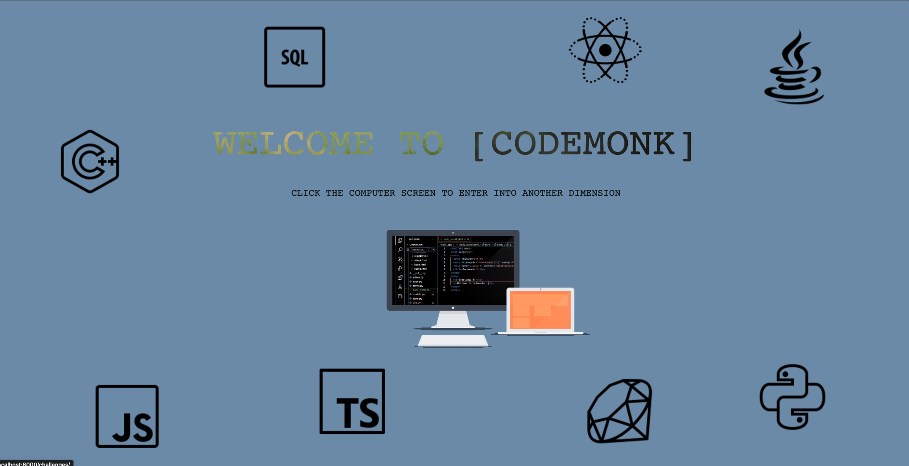
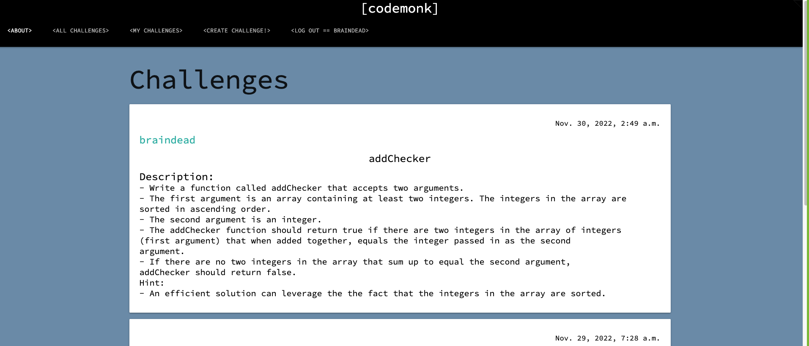
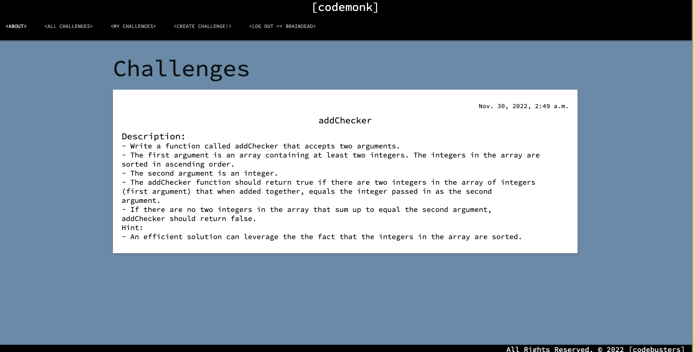
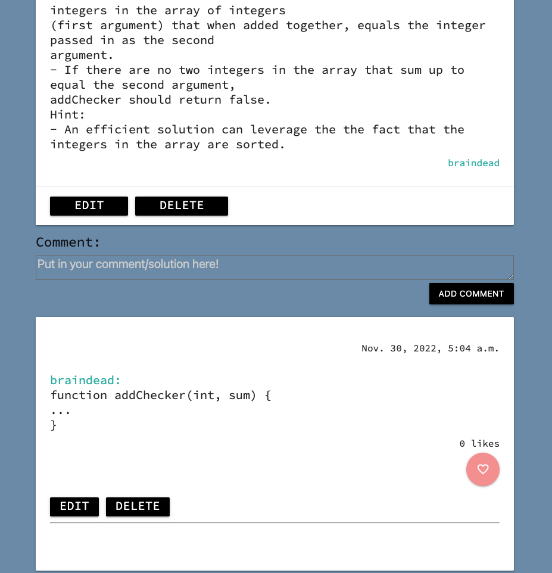
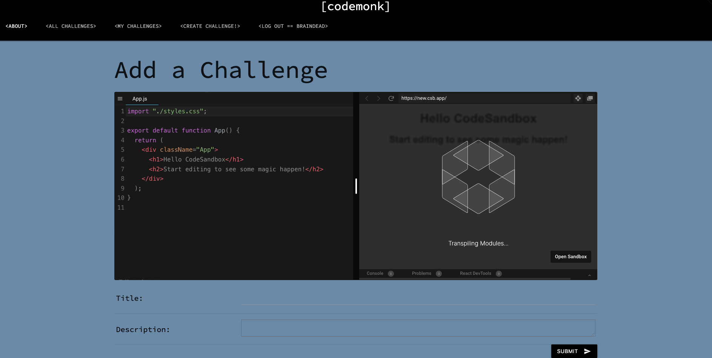

  # :computer: [codemonk] :computer:

  ### [Solve a Challenge](http://codemonk-wars.herokuapp.com/)

  ##### Created by Aman Gashaw, Andy Kim, Kristina Lim, Corey Summa

  ## :pencil: Description

  [codemonk] is an app where students can come together to do code challenges and discuss their challenges with one another. It is also a platform where students can come network and connect. Through these connections, we can learn from one another and collaboratively become better programmers.

   ## :camera_flash: Screenshots 
<h3 align="center">Welcome Page</h3>
 
<h3 align="center">Homepage</h3>
 
<h3 align="center">My Challenges</h3>
 
<h3 align="center">Comment Section</h3>
 
<h3 align="center">Add a Challenge</h3>

## :computer: Technologies Used

 

## :spiral_notepad: Getting Started

 #### [Project planning and wireframing](https://trello.com/b/ParGbIjE/project-3)

 * Enter the app and explore coding challenges created by your classmates.
 * Make a username and password to access [codemonks] full functionality.
 * Collaborate with classmates by:
    * Creating challenges
    * Solving challenges
    * Comment on solutions
    * Like solutions
 * Learn from your experiences and hone in on your programming skills. 

## :ice_cube: Icebox Features :ice_cube:
* Add a like button with a page full of liked challenges.
* Implement different languages (e.g. Python, JavaScript, etc).
* Add difficulty levels (easy, medium, hard).
* Implement an API similar to Replit.